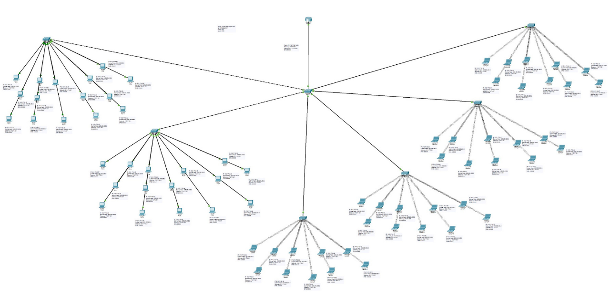

# Computer Network Design using Cisco Packet Tracer
This is a final project of the Computer Network course. In this project, I created a computer network design using Cisco Packet Tracer with 1 router 5 ports, 3 switch hubs 8 ports, 4 routers access points, 30 computers (wired), and 40 laptops (Wi-Fi) that must be connected to each other. For more detail on how the design along with all configuration, you may download and read my report that I have already attached within this repository.

